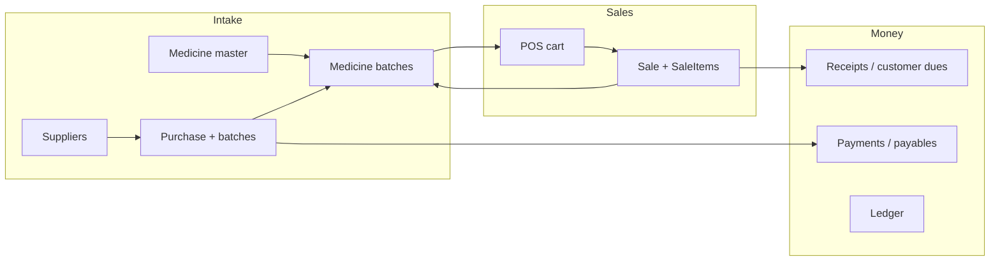

# Zenmedix / HealthPort ERP — Project Report

**Generated:** 2026-05-20  
**Stack:** Laravel, Livewire, Jetstream, Bootstrap 5, MySQL/SQLite (tests)

## 1. Executive summary

This application is a pharmacy ERP: POS sales, stock (medicines and batches), supplier purchases, accounting/MIS, receipts/payments, ledger, and S/R expiry. Recent work focused on **removing merge-conflict debris**, **deduplicating broken Livewire logic**, **aligning stock deduction with the batch sold at POS**, and **documenting data flow** for audits.

## 2. Code health and cleanup performed

| Area | Issue | Resolution |
|------|--------|------------|
| `PosSystem::addToCart` | Duplicate `cart[]` append after the if/else branch caused **double lines** per add. | Removed the dead second block; kept merge/update logic with `units_per_strip`. |
| `PosSystem::checkout` | Stock was reduced using **FEFO across all batches** for the medicine, not necessarily the **batch on the invoice**. | Pre-validate quantities; run sale + line items + batch deduction in a **DB transaction**; deduct **`batch_id` from cart** only. |
| `DashboardStats::render` | Duplicate `todaySales` / `revenue` queries and **unreachable** second `return view(...)`. | Single query path; one `return view(...)`. |
| `AccountingMis` | Unresolved merges; missing **outstanding** + **expiry** data; weak scoping in some branches. | Merged modals (sale receipt + outstanding details); `store_id` filters where appropriate; purchase book tab in UI. |
| Blade / CSS / `package-lock.json` | `<<<<<<<` / `=======` / `>>>>>>>` markers. | Resolved across accounting MIS view, POS view, `main.css`, lockfile name. |
| `pos-system.blade.php` | Duplicate `@keydown.window.escape`, broken info rows, extra cart `<td>` columns. | Single escape handler; consolidated header rows; cart row column count matches headers. |

## 3. Calculation and business rules (verification checklist)

Use this as a manual QA matrix (automated tests could not run in this environment — see §5).

### POS (`PosSystem`)

- **Line total:** `round(price * quantity, 2)` per cart line; **grand total** = sum of line `total`.
- **Strip/tablet split:** `quantity = strips * units_per_strip + tablets`; editing strips/tablets updates `quantity` and line total in `updatedCart`.
- **Purchase price on line:** Stored per **unit** when `units_per_strip > 1` for COGS consistency on `SaleItem`.
- **Checkout:** `amount_paid` defaults to `grandTotal` if zero; **stock** decreases on the **same `batch_id`** as the cart line.

### Dashboard (`DashboardStats`)

- **Revenue:** Sum of `sales.total_amount` for **today**, scoped by authenticated store (via `Sale` global scope).
- **COGS / gross profit:** Sum over line items: `purchase_price * quantity` (unit purchase price on `sale_items`).
- **Net profit:** `grossProfit - todayExpenses` (`Expense` is store-scoped).

### Accounting / MIS (`AccountingMis`)

- **MIS dashboard:** Today sales, expenses, gross/net profit, chart series, fast-moving SKUs (30 days) — sales joined with store filter on joins where applicable.
- **Day book:** Aggregates today’s sales, **medicine batch** rows as “purchase” lines (value = `quantity * purchase_price`), and expenses.
- **Outstanding:** Receivables = sales with `amount_paid < total_amount`; payables = purchases with `paid_amount < total_amount`.
- **Supplier payments** (`SupplierManager::makePayment`): Records `SupplierPayment` with configurable **`paymentMode`** (default Cash).

### Purchases (`SupplierManager::addItem`)

- **Line total:** Discount and GST applied to `qty * pPrice` → `total` stored on the line; bill total = sum of line totals.

## 4. Data flow (high level)



- **Stock truth:** `medicine_batches.quantity` (units). POS checkout reduces the batch row tied to the sale line.
- **Revenue truth:** `sales.total_amount` and `sale_items.total`.
- **Dues:** `sales.amount_paid` vs `total_amount`; `purchases.paid_amount` vs `total_amount`.

## 5. Testing status

- **`php artisan test`** failed: **Pest** / **PHPUnit** vendor code uses **PHP 8.3+ class constant syntax** (`public const array ...`) while the CLI reported **PHP 8.2.12** in this run. Upgrade CLI to **PHP ≥ 8.3** (match `composer.json` platform) or align `pestphp/phpunit` versions with PHP 8.2, then re-run:

  ```bash
  php artisan test
  ```

- **Syntax check:** `php -l` passed on modified Livewire classes listed in §2.

## 6. Residual risks / follow-ups

- **Bill preview** on POS (`Sale::count() + 1`) is not concurrency-safe; consider max(`id`)+1 or a dedicated sequence per store.
- **Day book “purchases”** from `MedicineBatch` may not match formal `Purchase` documents if batches are created outside supplier flow.
- **GST/discount** on POS UI is still mostly display placeholders (0).

## 7. Documentation

- End-user oriented steps: **`docs/USER_GUIDE.md`**.
